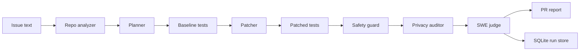

# Secure RepoPilot

[](https://github.com/PRINCE2-AI/secure-repopilot/actions/workflows/ci.yml)
[](https://www.python.org/)
[](https://platform.openai.com/docs)
[](https://fastapi.tiangolo.com/)
[](https://streamlit.io/)
[](LICENSE)

**Issue-to-PR coding agent with baseline verification, safety controls, and privacy auditing.**

Secure RepoPilot reads a bug report, analyzes a repository, runs baseline tests, applies a minimal patch, reruns verification, blocks unsafe commands, audits traces for leakage, and generates a PR-ready report.

Research basis:

- **SWE-Cycle**: full software issue lifecycle evaluation.
- **Phoenix**: safe GitHub issue resolution with specialized agents.
- **AgentVisor**: tool privilege separation and prompt-injection defense.
- **AgentLeak**: privacy leakage auditing across agent traces.

> [!NOTE]
> This is a portfolio-grade implementation inspired by current software-engineering-agent research. It is not a claim of benchmark-level SWE-bench performance.

## See It In Action

```bash
python demo.py
```

Expected demo shape:

```json
{
  "verdict": "accept",
  "changed_files": ["src/securecalc/calculator.py"],
  "baseline_passed": false,
  "patched_passed": true,
  "safety_risk": 0.0,
  "privacy_score": 1.0
}
```

The bundled sample repo contains a real failing test: `divide(8, 0)` should return `None`. Secure RepoPilot copies the repo to a scratch workspace, reproduces the failure, patches `calculator.py`, reruns tests, and writes a PR-style report.

## Why This Project

Most coding-agent demos stop at code generation. Secure RepoPilot focuses on the parts that matter in production:

- repo understanding before editing
- failing-test reproduction before patching
- minimal patch generation
- baseline-vs-patched verification
- command safety policy
- prompt-injection and secret scanning
- privacy leakage audit over agent traces
- structured PR report and metrics

## Architecture



## Features

- Repository scanner for files, languages, dependencies, and test commands.
- Issue parser with lightweight bug classification.
- Planner that selects suspected files and verification steps.
- Reproducer that captures baseline failing tests.
- Deterministic patcher for the bundled demo and extension point for OpenAI mutations.
- Tester that runs commands with timeouts and captured logs.
- SWE-style judge with `accept`, `needs_fix`, `unsafe`, and `inconclusive` verdicts.
- Security guard for blocked commands, prompt-injection text, and secret patterns.
- Privacy auditor for emails, private local paths, and token-like values.
- FastAPI endpoints, Streamlit dashboard, SQLite storage, docs, and CI.

## Quick Start

```bash
python -m venv .venv
```

Windows PowerShell:

```powershell
.\.venv\Scripts\Activate.ps1
pip install -r requirements.txt
Copy-Item .env.example .env
python demo.py
```

macOS/Linux:

```bash
source .venv/bin/activate
pip install -r requirements.txt
cp .env.example .env
python demo.py
```

Run tests:

```bash
pytest -q
```

No-dependency smoke test:

```bash
python tests/run_tests.py
```

Run API:

```bash
uvicorn app.api:api --reload
```

Run dashboard:

```bash
streamlit run app/ui.py
```

## API

| Endpoint | Purpose |
| --- | --- |
| `GET /health` | Check runtime configuration |
| `POST /run-fullcycle` | Run analyze, reproduce, patch, verify, audit, judge |
| `GET /runs` | List stored runs |
| `GET /runs/{run_id}` | Fetch one run payload |
| `GET /metrics/{run_id}` | Fetch compact run metrics |

Example:

```json
{
  "repo_path": "examples/buggy_python_repo",
  "issue_text": "Division by zero should return None",
  "apply_patch": true,
  "workspace": ".repopilot-runs"
}
```

## Evaluation Signals

| Signal | Meaning |
| --- | --- |
| `baseline_passed` | Whether detected tests passed before patching |
| `patched_passed` | Whether detected tests passed after patching |
| `regression_count` | Previously passing commands that failed after patching |
| `confidence` | Judge confidence in the final verdict |
| `safety_risk_score` | Risk from command/prompt/secret checks |
| `privacy_score` | Leakage audit score over traces and reports |

## Safety Boundaries

Secure RepoPilot is a local portfolio agent, not a hardened code-execution platform. It blocks risky commands and scans for secrets, but production use should add container isolation, read-only mounts, network denial, memory limits, and stronger policy enforcement.

## Resume Bullets

- Built Secure RepoPilot, a SWE-Cycle and Phoenix-inspired issue-to-PR coding agent that analyzes repositories, reproduces bugs, patches code, generates regression tests, and verifies fixes with baseline-vs-patched execution.
- Implemented AgentVisor-style tool safety controls and AgentLeak-style trace auditing to detect unsafe actions, prompt-injection risks, secrets exposure, and privacy leakage across agent logs and outputs.
- Added FastAPI, Streamlit observability, SQLite run tracking, CI tests, patch scoring, risk metrics, and PR-ready report generation for production-style autonomous software engineering workflows.

## Roadmap

- Add OpenAI patch proposals with structured output validation.
- Add Docker sandbox execution.
- Add GitHub issue ingestion through the GitHub API.
- Add unified diff apply/revert for arbitrary repositories.
- Add benchmark pack for multiple mini repos and issue types.
