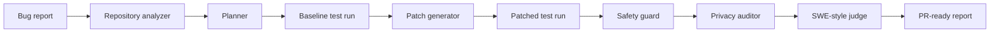

# Secure RepoPilot Case Study

## Problem

Most coding-agent demos generate patches without proving that the original failure was reproduced, the patch was minimal, or the agent avoided unsafe commands and private-data leakage. Secure RepoPilot focuses on the full issue-to-PR loop with verification and safety controls.

## Research Basis

- SWE-Cycle: full software issue lifecycle evaluation.
- Phoenix: safe GitHub issue resolution with specialized agents.
- AgentVisor: tool privilege separation and prompt-injection defense.
- AgentLeak: privacy leakage auditing across agent traces.

## System Design

## Engineering Decisions

- Reproduced the baseline failure before patching so the agent does not claim success without evidence.
- Used a minimal deterministic patch path for the bundled demo, with extension points for OpenAI-powered patch generation.
- Added command safety checks around tool execution.
- Audited agent traces for email, local path, and token-like leakage.
- Stored run results so the dashboard and API can show decision evidence.

## Validation Evidence

| Signal | Result |
| --- | --- |
| Demo verdict | accept |
| Baseline test state | failing before patch |
| Patched test state | passing after patch |
| Changed files | `src/securecalc/calculator.py` |
| Safety risk | 0.0 |
| Privacy score | 1.0 |
| GitHub Actions | CI workflow present |

## Why It Matters For AI Engineering

This project shows practical agent reliability work: repository understanding, test reproduction, patch verification, safety boundaries, privacy auditing, structured reports, and product-style API/dashboard surfaces.

## Limitations

- The bundled demo is intentionally small and deterministic.
- It does not claim SWE-bench performance.
- The command safety policy is a guardrail and should be expanded before production use.
- Real repository mutation should run in an isolated sandbox with stronger filesystem and network controls.

## Next Improvements

- Add GitHub issue ingestion and branch creation.
- Add OpenAI structured patch proposals with diff validation.
- Add larger multi-language benchmark fixtures.
- Add trace export for LangSmith or Langfuse.
